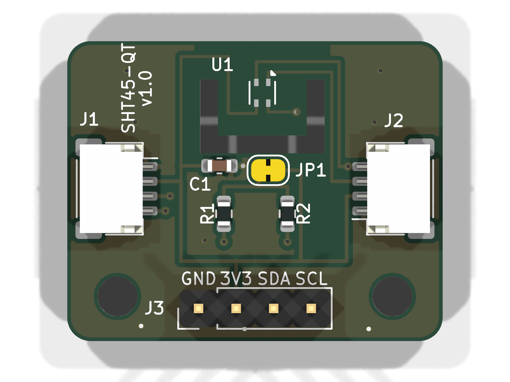
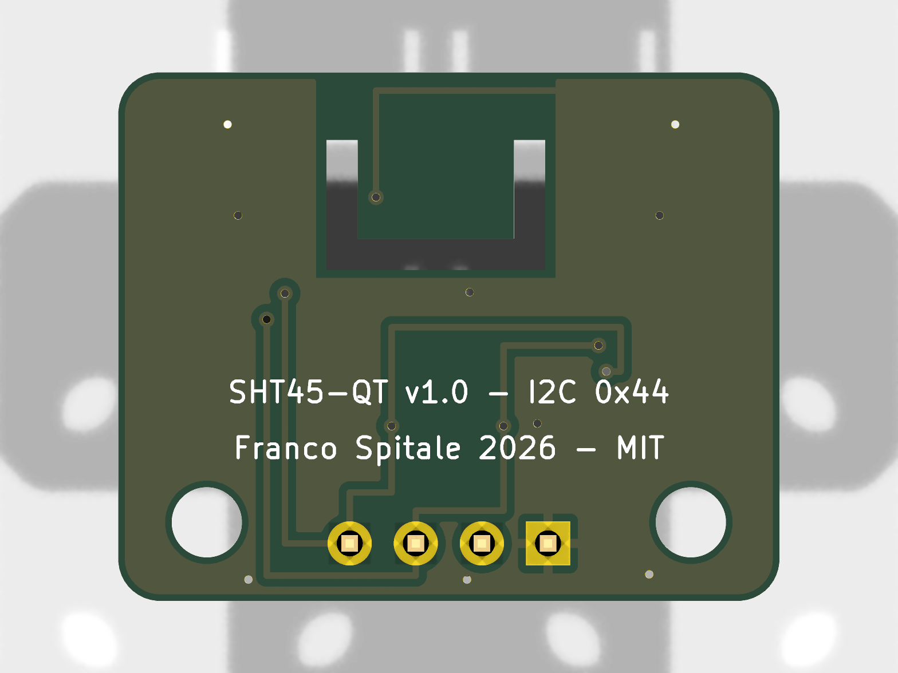

# SHT45-QT — precision temperature & humidity breakout

A small open-source breakout for the **Sensirion SHT45** (±1.0 % RH, ±0.1 °C) with
**Qwiic / STEMMA QT** connectors, designed in **KiCad 9**. 25.4 × 20.3 mm, 2 layers,
ready to fabricate at JLCPCB (gerbers included).

| Top | Bottom |
|---|---|
|  |  |

Schematic: [docs/schematic.svg](docs/schematic.svg) · Source: [hardware/](hardware/)

## Features

- Sensirion **SHT4x** family (SHT40 / SHT41 / SHT45 are drop-in compatible, same DFN-4 footprint)
- Two **JST SH 4-pin** (Qwiic/STEMMA QT) connectors for daisy-chaining, plus a
  0.1" **GND · 3V3 · SDA · SCL** header for breadboards
- I²C address **0x44** (fixed by the chip)
- 10 k I²C pull-ups with a **cuttable solder jumper** (JP1)
- Thermally isolated sensor island (milled U-slot + copper keepout)
- 2 × M2.5 mounting holes

## Design decisions

**Thermal isolation slot.** Temperature sensors don't measure air — they measure
their own die. Anything that couples the die to the PCB's thermal mass (copper
pours, nearby components) slows response and biases the reading. The sensor sits
on a small tongue isolated by a 1.2 mm milled U-slot, connected only through two
narrow bridges that carry the four traces. Copper pour is excluded from the
tongue and bridges on both layers; only the four signal/power traces (0.2 mm)
cross over.

**No power LED.** A power LED burns 1–3 mA a few millimetres from a sensor specified
to ±0.1 °C — that's measurable self-heating, and it ruins battery budgets on a part
that idles at well under 1 µA. If you need a visual heartbeat, blink it from the host.

**Pull-ups behind a solder jumper.** Qwiic chains accumulate pull-ups: every board
in the chain adds its pair in parallel. JP1 ships bridged (pull-ups enabled) —
cut the trace between the pads to disable them when your controller board or
another breakout already provides them. 10 k was chosen over the more common
4.7 k so that two or three boards left enabled by accident still keep the bus
within spec instead of overloading the drivers.

**Decoupling cap just off the island.** The 100 nF cap sits ~4.5 mm from the sensor,
on the main board side of the slot, instead of on the tongue. Trade-off: Sensirion
asks for the cap "close to the sensor", but a ceramic cap on the tongue adds thermal
mass exactly where we're trying to remove it. At SHT4x supply currents (µA idle,
sub-mA peaks during measurement) 4.5 mm of 0.2 mm trace is electrically negligible,
so the thermal argument wins.

**Routing.** Solid GND pours on both layers with stitching vias; the bottom layer
stays a nearly unbroken plane except for a short bus corridor to the header. Signals
enter the sensor island from the top row of pads, power from the bottom row, so no
net ever crosses another on the tongue.

## Specs

| Parameter | Value |
|---|---|
| Sensor | SHT45 (SHT40/41 compatible) |
| Accuracy (SHT45) | ±1.0 % RH, ±0.1 °C (typ.) |
| Supply | 1.08 – 3.6 V (board intended for 3.3 V Qwiic) |
| Interface | I²C, address 0x44, up to 1 MHz |
| Board | 25.4 × 20.3 mm, 2-layer, 1.6 mm FR-4 |
| Min track/clearance used | 0.20 mm / 0.20 mm (JLCPCB standard is 0.127 mm) |
| Mounting | 2 × M2.5 |

## Fabrication

`fabrication/sht45-qt-gerbers-jlcpcb.zip` uploads directly to JLCPCB:
2 layers, 1.6 mm, any finish (ENIG recommended if you hand-solder the DFN),
standard stackup. The internal U-slot is 1.2 mm wide — above JLCPCB's 0.8 mm
minimum for routed slots. `sht45-qt-bom.csv` and `sht45-qt-pos.csv` are ready
for the assembly service (add LCSC part numbers at order time).

The DFN-4 sensor is hand-solderable with hot air and gel flux; everything else
is 0603 or larger.

## Using it

Any SHT4x library works, e.g. [Sensirion arduino-i2c-sht4x](https://github.com/Sensirion/arduino-i2c-sht4x)
or [Adafruit_SHT4x](https://github.com/adafruit/Adafruit_SHT4X):

```cpp
#include <Adafruit_SHT4x.h>
Adafruit_SHT4x sht4;

void setup() {
  sht4.begin();                       // 0x44
  sht4.setPrecision(SHT4X_HIGH_PRECISION);
}

void loop() {
  sensors_event_t rh, t;
  sht4.getEvent(&rh, &t);
  // t.temperature (°C), rh.relative_humidity (%RH)
  delay(1000);
}
```

For fast response, mount the board sensor-edge up, away from heat sources, and
give the slot free airflow on both sides.

## Verification

- ERC: 0 errors, 0 warnings ([hardware/erc.rpt](hardware/erc.rpt))
- DRC: 0 violations **including warnings**, 0 unconnected items,
  0 schematic-parity issues ([hardware/drc.rpt](hardware/drc.rpt))
- Pinout cross-checked against the [Sensirion SHT4x datasheet](https://sensirion.com/resource/datasheet/sht4x)

## Repository layout

```
hardware/     KiCad 9 project (schematic, PCB, ERC/DRC reports)
fabrication/  Gerbers zip (JLCPCB), BOM, pick & place
docs/         Renders and schematic SVG
```

## License

MIT — see [LICENSE](LICENSE). Hardware provided as-is, no warranty; review before
fabricating.

---
*Designed by Franco Spitale, 2026. Rev 1.0 — not yet fabricated; if you build one,
open an issue with your results.*
